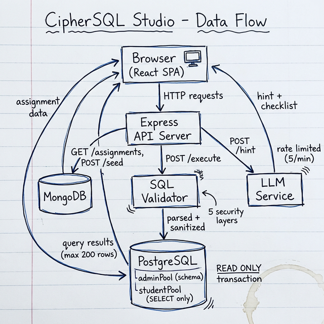

# Data-Flow Diagram

Hand-drawn overview of how data moves through CipherSQL Studio.



## Summary

```
Browser (React)
    |
    |  HTTP
    v
Express API ──────────────────────────┐
    |              |                  |
    |  assignments |  execute query   |  get hint
    v              v                  v
 MongoDB      SQL Validator       LLM Service
               |                  (rate limited)
               v
           PostgreSQL
          ┌─────────────┐
          │ adminPool    │ → schema info
          │ studentPool  │ → SELECT only, read-only txn
          └─────────────┘
```

### The execute flow in detail

1. User writes SQL in Monaco editor, hits Ctrl+Enter
2. Frontend sends `POST /api/assignments/:id/execute` with `{ sql }`
3. Backend validates:
   - AST parse → must be single SELECT
   - Keyword denylist (23 blocked words)
   - Function denylist (8 blocked functions)
4. Opens a `studentPool` connection
5. Wraps in `BEGIN READ ONLY` with 10s timeout
6. Sets `search_path` to the assignment's schema
7. Wraps query in `SELECT * FROM (...) LIMIT 200`
8. Returns `{ columns, rows, rowCount, executionTime }`
9. Logs attempt to MongoDB in the background

### The hint flow

1. User clicks "Get Hint"
2. Frontend sends `POST /api/assignments/:id/hint`
3. Rate limiter checks (5 requests/min per IP)
4. LLM service generates contextual hint based on:
   - The question text
   - User's current SQL (if any)
   - Last error message (if any)
5. Response gets checked for accidental solutions
6. Returns `{ hint, level, checklist }`
